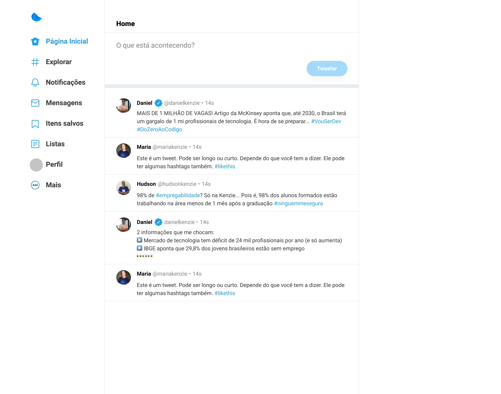

 

## 🚀 Tecnologias

Neste projeto foram utilizadas as seguintes tecnologias:

- HTML
- CSS
- JS

## 💻 Curso

Projeto desenvolvido durante a III Maratona da [Kenzie Academy](https://kenzie.com.br/) que ocorreu no dia 28/08/2021, para aprendizado do HTML, CSS e JS. Durante o evento, foi desenvolvido uma cópia da home page do [Twitter](https://twitter.com/).